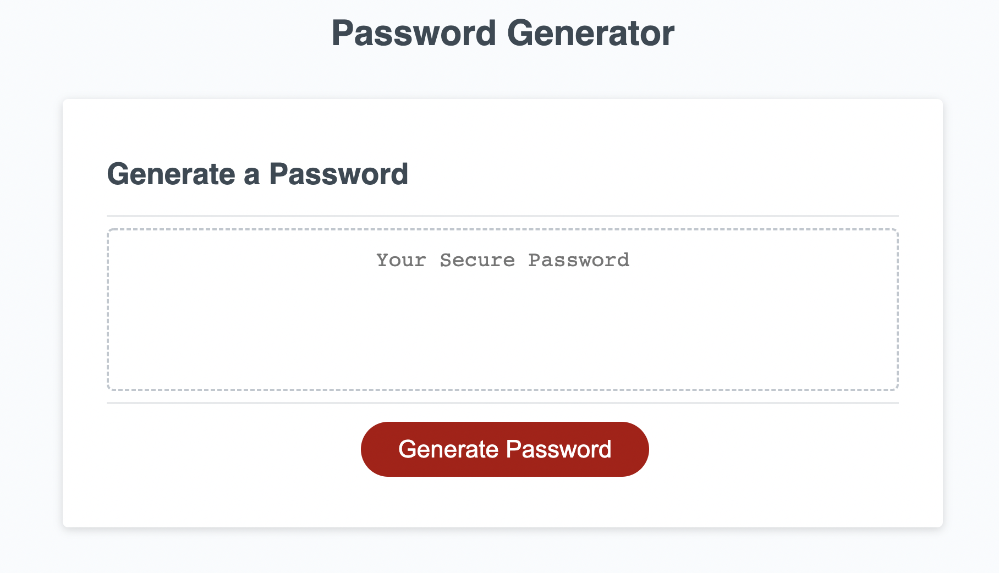
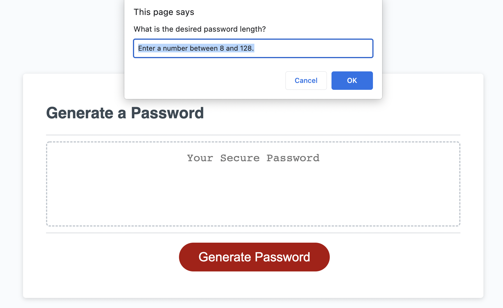
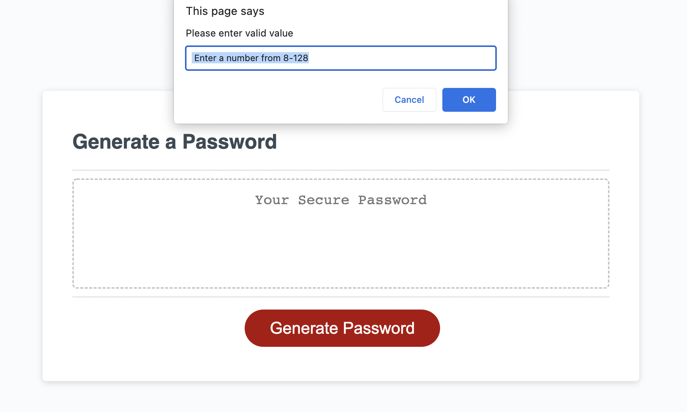
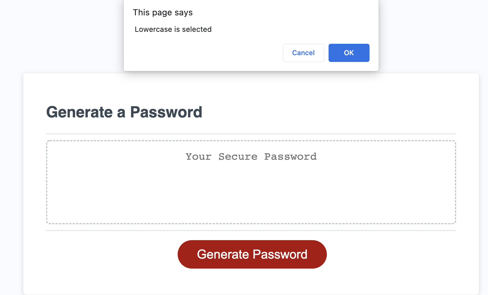
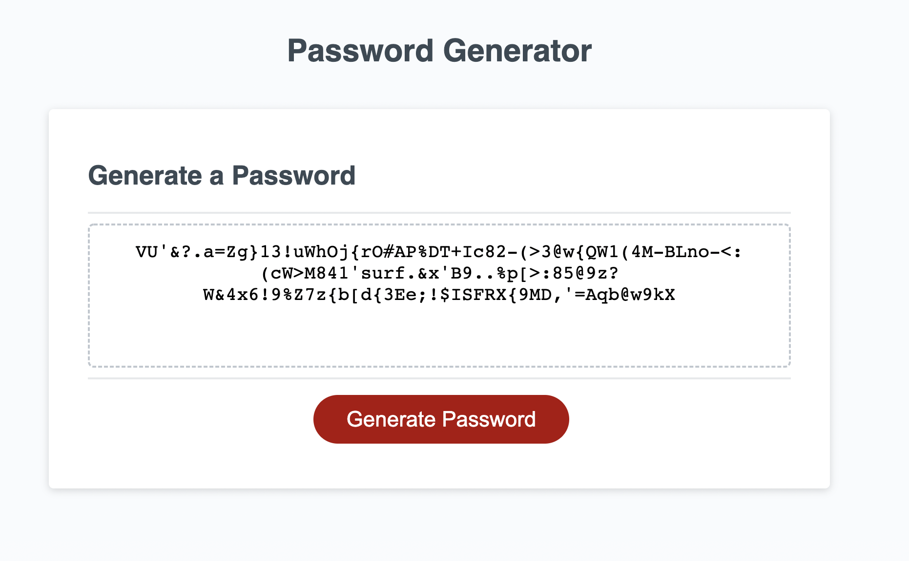

# Challenge 3 Using Javascript to create Random Password Generator

Using mainly Javascript, a random password generator application is created to fit the criteria that is listed below. Link to [application](https://pppreap.github.io/challenge3_password/).

# User Story
AS AN employee with access to sensitive data
I WANT to **randomly generate a password** that meets certain criteria
SO THAT I can create a **strong password** that provides greater security.
The developer will created an application that an employee can use to generate a random password based on criteria they've selected.

## Acceptance Criteria
An **new, secure password  will fit the criteria** below:

WHEN the button is pressed to generate password,
THEN user is presented with a **series of prompts** for password criteria.

WHEN prompted for password criteria,
THEN **user select which criteria** to include in the password.

WHEN prompted for the length of the password,
THEN user **choose a length of at least 8 characters and no more than 128 characters**.

WHEN asked for character types to include in the password
THEN I **confirm** whether or not to include lowercase, uppercase, numeric, and/or special characters

WHEN user answer each prompt,
THEN  **input should be validated** and **at least one character type should be selected**

WHEN all prompts are answered,
THEN a password is generated that matches the selected criteria.

WHEN the password is **generated**,
THEN the **password is either displayed in an alert or written to the page**.

### Assets
These images shows the **visuals of the password generator** start page, example of prompt and  page of successful generation of password in the text area.

#### Links
[Github Repository Link](https://github.com/pppreap/challenge3_password) 
///
[Link to Password Generator Application](https://pppreap.github.io/challenge3_password/)

#### Credits
Original Start Code from Michigan State University Coding Bootcamp 2022.
